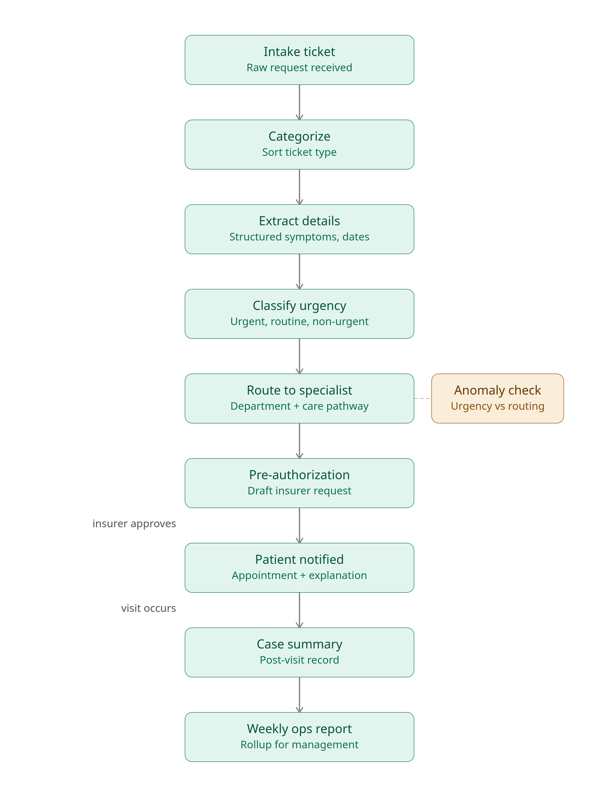

# 10 prompt library to automate a multi speciality diagnostic center's workflow

## What this is about
This is an automation project trying to reduce the workload and increase efficiency in a multispeciality referral and diagnostics center. I picked this business field because it has a high automation potential while still carrying real decision making and oversights requirement. 

## The pipeline

## How this repo is organized
- /prompts- This folder includes one file per prompt. Each file includes different versions of prompt, their automation potential and risks.
- /iterations- This folder contains an interation log file which logged each iteration as it happened . It also includes link to the main file where the prompts were tested.

## Prompting strategies used 
- Prompt chaining: The library uses prompt chaining to feed one prompt's output into another prompt's input.Removing the need to repeatedly parse raw text. (IBM, 2026)
- Role prompting: Role prompting was applied selectively where it matters. It was added in prompts like pre authorization drafting and patient appointment notification to dynamically adjust tones where it matters.(LearnPrompting, 2024)
- Minimizing Personally Identifiable Information(PII): Given the sensitivity of healthcare data, PII was minimized at each stage  with standard healthcare data protection principles.(HIPAA Journal, 2026)

## How to navigate
Look at the iteration file first. It will give you a brief overview of how the iterations occured and what changed. After that, click individual links from those iterations or directly open the prompt folder to acess all individual prompt files and their contents.

## References
IBM. (2026). What is prompt chaining? https://www.ibm.com/think/topics/prompt-chaining

LearnPrompting. (2024). Role prompting: Guide LLMs with persona-based tasks. https://learnprompting.org/docs/advanced/zero_shot/role_prompting

HIPAA Journal. (2026). HIPAA, healthcare data, and artificial intelligence. https://www.hipaajournal.com/hipaa-healthcare-data-and-artificial-intelligence/
